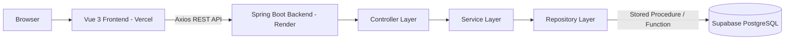
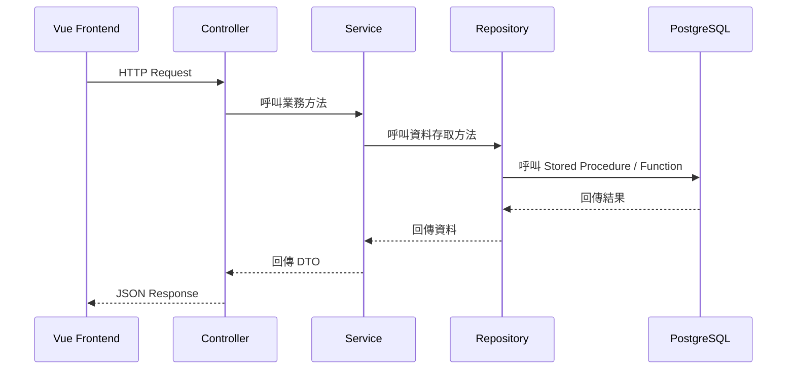

# ESUN Library Borrowing System 開發歷程與 Debug 報告

**作者：** Jimmy Chang（張祐豪）  
**所屬單位：** 國立中央大學 電資學院 網路學習科技研究所  
**專案名稱：** ESUN Library Borrowing System  
**GitHub Repository：** https://github.com/a88019401/esun-library-system.git  
**Frontend Deployment：** https://esun-library-system.vercel.app  
**Backend Deployment：** https://esun-library-system.onrender.com  
**撰寫目的：** 本報告彙整本專案從資料庫設計、後端開發、前端開發、部署到 Debug 修正的完整過程，供面試主管了解開發思路、實作細節、問題排查與最終完成狀態。

---

## 1. 專案概述

本專案是一套線上圖書借閱系統，採用前後端分離架構，使用 **Vue 3** 作為前端、**Spring Boot** 作為後端、**Supabase PostgreSQL** 作為關聯式資料庫。

系統主要功能包含：

- 使用手機號碼註冊帳號
- 使用手機號碼與密碼登入
- 密碼以 BCrypt 雜湊後儲存
- 登入成功後回傳 JWT Token
- 未登入使用者可查看書籍列表
- 登入使用者可借閱可借閱狀態的書籍
- 登入使用者可歸還自己借閱的書籍
- 借書與還書流程使用 Transaction 確保資料一致性
- 後端透過 Stored Procedure / Function 存取資料庫
- 前端透過 Axios 呼叫 RESTful API
- 部署為 Vercel 前端 + Render 後端 + Supabase PostgreSQL

---

## 2. 最終系統架構

本專案採用三層式架構，分為 Web Server / Frontend Layer、Application Server Layer、Relational Database Layer。

```text
Browser
→ Vue 3 Frontend on Vercel
→ Spring Boot Backend on Render
→ Supabase PostgreSQL
```

### 2.1 架構對應

| 架構層級 | 本專案實作 | 說明 |
|---|---|---|
| Web Server / Frontend | Vue 3 + Vite，部署於 Vercel | 提供使用者操作介面 |
| Application Server | Spring Boot + Embedded Tomcat，部署於 Render | 提供 RESTful API、JWT 驗證、業務邏輯與 Transaction |
| Relational Database | Supabase PostgreSQL | 儲存使用者、書籍、庫存與借閱紀錄 |

### 2.2 系統架構圖



---

## 3. 後端分層設計

後端依照展示層、業務層、資料層、共用層進行設計。

| 層級 | Package | 代表檔案 | 職責 |
|---|---|---|---|
| 展示層 | `controller` | `AuthController`, `BookController`, `BorrowController` | 接收 HTTP Request 並回傳 API Response |
| 業務層 | `service` | `AuthService`, `BookService`, `BorrowService` | 處理註冊、登入、借還書邏輯與 Transaction |
| 資料層 | `repository` | `UserRepository`, `BookRepository`, `BorrowRepository` | 使用 JdbcTemplate 呼叫 Stored Procedure / Function |
| 共用層 | `common`, `dto`, `security`, `config` | `GlobalExceptionHandler`, DTOs, `JwtUtil`, `SecurityConfig` | 統一回應格式、例外處理、安全設定、JWT 工具 |

### 3.1 後端呼叫流程



---

## 4. 資料庫設計歷程

### 4.1 主要資料表

本專案建立以下主要資料表：

| Table | 說明 |
|---|---|
| `app_user` | 使用者資料 |
| `book` | 書籍主檔 |
| `inventory_status` | 庫存狀態代碼 |
| `inventory` | 實體館藏庫存 |
| `borrowing_record` | 借閱紀錄 |

### 4.2 正規化設計

一開始設計資料庫時，將 `book` 與 `inventory` 拆成兩張表：

```text
book      = 書籍主檔，例如 ISBN、書名、作者、簡介
inventory = 實體館藏，例如同一本書的第 1 本、第 2 本
```

這樣設計可以避免書籍資訊重複儲存，也能支援同一本書有多本實體館藏。

後續測試時曾發現 `Clean Code` 出現兩筆，看起來像重複資料：

```text
inventory_id = 1 → ISBN 9789865020011 → Clean Code
inventory_id = 2 → ISBN 9789865020011 → Clean Code
```

經檢查後確認這不是資料庫錯誤，而是因為同一本書有兩筆實體館藏，符合圖書館情境與正規化設計。

### 4.3 Stored Routine

資料庫操作集中在 Stored Function / Procedure 中，主要包含：

| Routine | 功能 |
|---|---|
| `fn_list_books()` | 查詢書籍列表 |
| `fn_find_user_by_phone(phone)` | 依手機號碼查詢使用者 |
| `sp_register_user(...)` | 註冊使用者 |
| `sp_update_last_login(userId)` | 更新最後登入時間 |
| `sp_borrow_book(userId, inventoryId)` | 借書 |
| `sp_return_book(userId, inventoryId)` | 還書 |

後期為了解決「非借閱者也看到還書按鈕」的問題，將 `fn_list_books()` 更新為：

```sql
CREATE OR REPLACE FUNCTION fn_list_books(p_user_id BIGINT DEFAULT NULL)
RETURNS TABLE (
    inventory_id BIGINT,
    isbn VARCHAR,
    name VARCHAR,
    author VARCHAR,
    introduction TEXT,
    status VARCHAR,
    borrowed_by_me BOOLEAN
)
```

這樣後端可以依照目前登入者判斷某本書是否由本人借閱。

---

## 5. 後端開發流程

### 5.1 Spring Boot 專案建立

後端使用 Spring Boot + Maven 建立，主要依賴包含：

- `spring-boot-starter-web`
- `spring-boot-starter-security`
- `spring-boot-starter-validation`
- `spring-boot-starter-data-jdbc`
- PostgreSQL JDBC Driver
- JJWT
- Spring Security Test

雖然本機曾出現 Java 26，但專案本身以 Java 17 為基準，後續 Docker / Render 部署也使用 Java 17，以降低版本不相容風險。

---

### 5.2 Supabase PostgreSQL 連線

後端透過 `application.yml` 讀取環境變數：

```yml
spring:
  datasource:
    url: ${DB_URL}
    username: ${DB_USERNAME}
    password: ${DB_PASSWORD}
```

本機開發時使用 `backend/.env`，部署到 Render 時則使用 Render Dashboard 的 Environment Variables。

第一次成功啟動後，後端 log 顯示 HikariCP 成功連線：

```text
HikariPool-1 - Added connection org.postgresql.jdbc.PgConnection
HikariPool-1 - Start completed.
Tomcat started on port 8080
Started LibraryApplication
```

這表示 Spring Boot 與 Supabase PostgreSQL 連線已正常建立。

---

### 5.3 書籍列表 API

建立以下檔案：

```text
BookResponse.java
BookRepository.java
BookService.java
BookController.java
```

API：

```http
GET /api/books
```

初期測試結果成功回傳書籍 JSON：

```json
[
  {
    "inventoryId": 1,
    "isbn": "9789865020011",
    "name": "Clean Code",
    "author": "Robert C. Martin",
    "status": "AVAILABLE"
  }
]
```

---

### 5.4 使用者註冊 API

建立註冊流程：

```text
AuthController
→ AuthService
→ UserRepository
→ sp_register_user()
```

API：

```http
POST /api/auth/register
```

Request：

```json
{
  "phoneNumber": "0912345679",
  "password": "password123",
  "userName": "Jimmy"
}
```

測試時曾先遇到 `400 Bad Request`，後續確認使用新的手機號碼後註冊成功。Supabase 查詢結果顯示密碼已被 BCrypt 雜湊，不是明碼：

```text
password_hash = $2a$10$...
```

這表示密碼安全設計正常。

---

### 5.5 使用者登入 API + JWT

登入流程：

```text
AuthController
→ AuthService
→ UserRepository 查詢使用者
→ BCrypt 比對密碼
→ 更新 last_login_time
→ 產生 JWT Token
```

API：

```http
POST /api/auth/login
```

成功後回傳：

```json
{
  "token": "eyJhbGciOiJIUzM4NCJ9...",
  "tokenType": "Bearer",
  "userName": "Jimmy"
}
```

資料庫中也成功更新 `last_login_time`。

---

### 5.6 Spring Security 設定

初期 Spring Security 啟動時會產生預設密碼：

```text
Using generated security password: ...
```

這是 Spring Security 預設行為。後續建立 `SecurityConfig.java`，關閉不需要的 form login / http basic，改成 JWT Stateless 驗證。

公開 API：

```text
GET  /api/books
POST /api/auth/register
POST /api/auth/login
```

受保護 API：

```text
POST /api/borrows/{inventoryId}
POST /api/borrows/{inventoryId}/return
```

---

### 5.7 借書 API

借書流程：

```text
BorrowController
→ BorrowService @Transactional
→ BorrowRepository
→ sp_borrow_book(userId, inventoryId)
```

API：

```http
POST /api/borrows/{inventoryId}
Authorization: Bearer <JWT_TOKEN>
```

借書成功後：

```text
inventory.status_code = BORROWED
borrowing_record 新增一筆 return_time = NULL 的借閱紀錄
```

測試時使用 PowerShell 取得 token 後借書成功：

```powershell
$login = Invoke-RestMethod `
  -Uri "http://localhost:8080/api/auth/login" `
  -Method POST `
  -ContentType "application/json" `
  -Body '{"phoneNumber":"0912345679","password":"password123"}'

$token = $login.token

Invoke-RestMethod `
  -Uri "http://localhost:8080/api/borrows/1" `
  -Method POST `
  -Headers @{ Authorization = "Bearer $token" }
```

---

### 5.8 還書 API

還書流程：

```text
BorrowController
→ BorrowService @Transactional
→ BorrowRepository
→ sp_return_book(userId, inventoryId)
```

API：

```http
POST /api/borrows/{inventoryId}/return
Authorization: Bearer <JWT_TOKEN>
```

還書成功後：

```text
borrowing_record.return_time 更新
inventory.status_code = AVAILABLE
```

測試後資料庫紀錄顯示：

```json
{
  "record_id": 2,
  "user_id": 2,
  "inventory_id": 1,
  "borrowing_time": "2026-04-29 22:09:54.467052+00",
  "return_time": "2026-04-29 22:11:37.7624+00"
}
```

---

### 5.9 JWT 保護測試

測試不帶 JWT 呼叫借書 API：

```powershell
Invoke-RestMethod `
  -Uri "http://localhost:8080/api/borrows/2" `
  -Method POST
```

結果：

```text
遠端伺服器傳回一個錯誤: (403) 禁止。
```

這表示未登入者無法借書，後端權限保護有效。

---

## 6. 前端開發流程

### 6.1 Vue 專案建立

使用 Vite 建立 Vue 專案。功能選擇：

```text
Router：選擇
ESLint：選擇
Prettier：選擇
TypeScript：未選擇
Pinia：未選擇
Vitest：未選擇
E2E：未選擇
```

當時未選 TypeScript 的原因是本實作重點在全端流程、API、JWT、Transaction 與部署，前端資料結構相對單純，因此先以 JavaScript 完成 MVP，降低複雜度。

---

### 6.2 Git 操作踩坑

前端 scaffold 後曾遇到：

```text
Untracked files:
../.vscode/
../node_modules/
```

原因是當時在 `frontend/` 目錄執行：

```bash
git add .
```

只會加入 `frontend/` 內的檔案，不會處理上一層專案根目錄的 `.vscode/` 與 `node_modules/`。

後續修正方式：

- 回到專案根目錄處理 Git
- 補上根目錄 `.gitignore`
- 確保 `.env`、`node_modules`、`target`、`dist` 不被提交

---

### 6.3 Axios 共用設定

建立：

```text
frontend/src/api/http.js
```

主要功能：

- 設定 API base URL
- 自動帶入 JWT token

```js
const http = axios.create({
  baseURL: import.meta.env.VITE_API_BASE_URL,
  timeout: 10000,
})

http.interceptors.request.use((config) => {
  const token = localStorage.getItem('token')

  if (token) {
    config.headers.Authorization = `Bearer ${token}`
  }

  return config
})
```

---

### 6.4 書籍列表頁

建立：

```text
BookListView.vue
```

功能：

- 呼叫 `GET /api/books`
- 顯示書名、作者、ISBN、庫存編號、簡介與狀態
- 顯示借閱與還書按鈕
- 操作後重新載入書籍列表

---

### 6.5 CORS 問題與修正

前端第一次串接後端時，瀏覽器 console 出現：

```text
Access-Control-Allow-Origin Missing Header
```

直接在瀏覽器開啟：

```text
http://localhost:8080/api/books
```

可以看到 JSON，表示後端 API 與資料庫正常。

但 Vue 前端位於：

```text
http://localhost:5173
```

後端位於：

```text
http://localhost:8080
```

兩者 port 不同，瀏覽器視為不同來源，因此被 CORS 擋住。

修正方式是在 `SecurityConfig.java` 中加入：

```java
.cors(Customizer.withDefaults())
```

並設定允許來源：

```java
config.setAllowedOrigins(List.of(
    "http://localhost:5173",
    "http://127.0.0.1:5173",
    "http://localhost:4173",
    "http://127.0.0.1:4173",
    "https://esun-library-system.vercel.app"
));
```

修正後 Vue 前端成功顯示 6 筆書籍資料。

---

### 6.6 Router 空白頁問題

建立登入與註冊頁後，曾遇到開啟：

```text
http://localhost:5173/register
```

畫面沒有出現內容。

檢查後發現 `App.vue` 已經有：

```vue
<RouterView />
```

問題在於 `router/index.js` 尚未正確註冊 `/login` 與 `/register` route。

修正後加入：

```js
{
  path: '/login',
  name: 'login',
  component: LoginView,
},
{
  path: '/register',
  name: 'register',
  component: RegisterView,
}
```

修正後登入與註冊頁正常顯示。

---

### 6.7 登入狀態同步

登入成功後，前端儲存：

```js
localStorage.setItem('token', response.data.token)
localStorage.setItem('userName', response.data.userName)
```

並觸發：

```js
window.dispatchEvent(new Event('auth-changed'))
```

`App.vue` 監聽此事件後更新 Navbar 狀態，顯示：

```text
您好，使用者名稱
登出
```

---

## 7. 重要 Bug：非借閱者看到還書按鈕

### 7.1 問題描述

在部署前測試時發現：

```text
A 帳號借書
B 帳號登入
B 看到 A 借走的書仍然出現「還書」按鈕
B 按下還書後，後端回傳錯誤：
ERROR: Borrowing record not found
```

### 7.2 問題原因

前端當時只用以下條件判斷是否顯示還書按鈕：

```text
book.status === 'BORROWED'
```

因此只要書籍狀態是已借出，不管是不是目前使用者本人借的，都會顯示還書按鈕。

但後端的 `sp_return_book(userId, inventoryId)` 會根據 JWT 解析出的 `userId` 查詢借閱紀錄。B 帳號沒有該筆未歸還紀錄，所以後端正確拒絕還書。

### 7.3 風險評估

這個問題主要是前端 UX / 顯示邏輯 bug。  
後端已正確阻擋非本人還書，因此資料沒有被錯誤更新。

### 7.4 修正方式

後端 `fn_list_books()` 新增 `borrowed_by_me` 欄位：

```sql
EXISTS (
    SELECT 1
    FROM borrowing_record br
    WHERE br.inventory_id = i.inventory_id
      AND br.user_id = p_user_id
      AND br.return_time IS NULL
) AS borrowed_by_me
```

後端 DTO 新增：

```java
private Boolean borrowedByMe;
```

前端按鈕邏輯改成：

```vue
<button
  v-else-if="book.status === 'BORROWED' && book.borrowedByMe"
  class="return-button"
>
  還書
</button>

<button
  v-else-if="book.status === 'BORROWED' && !book.borrowedByMe"
  disabled
>
  已借出
</button>
```

### 7.5 修正後行為

| 情境 | 前端顯示 |
|---|---|
| 書籍可借 | 借閱 |
| 書籍已被目前登入者借走 | 還書 |
| 書籍已被其他人借走 | 已借出 |
| 書籍其他狀態 | 暫不可借 |

這次修正也同步更新 `backend/DB/02_routines.sql`，避免未來重建資料庫時 function 版本不一致。

---

## 8. 部署流程

### 8.1 前端部署到 Vercel

前端部署流程：

```text
Vercel
→ Import GitHub Repository
→ Root Directory: frontend
→ Framework: Vite
→ Build Command: npm run build
→ Output Directory: dist
```

Vercel 環境變數設定：

```text
VITE_API_BASE_URL=https://esun-library-system.onrender.com/api
```

注意：Vercel 的環境變數是在 build 階段寫入 bundle，因此修改後需要重新 Redeploy。

---

### 8.2 後端部署到 Render

Render 建立服務時發現 Language 選單沒有 Java，因此改用 Docker 部署。

建立：

```text
backend/Dockerfile
```

內容使用 multi-stage build：

```dockerfile
FROM maven:3.9.9-eclipse-temurin-17 AS build
WORKDIR /app
COPY . .
RUN chmod +x mvnw && ./mvnw clean package -DskipTests

FROM eclipse-temurin:17-jre
WORKDIR /app
COPY --from=build /app/target/*.jar app.jar
ENV PORT=8080
EXPOSE 8080
ENTRYPOINT ["java", "-jar", "app.jar"]
```

Render 設定：

```text
Language: Docker
Root Directory: backend
Dockerfile Path: Dockerfile
```

---

## 9. Render 部署 Debug 紀錄

### 9.1 根路徑出現 403

部署成功後直接打開：

```text
https://esun-library-system.onrender.com/
```

出現：

```text
HTTP ERROR 403
```

檢查後確認這不是部署失敗，而是因為 Spring Security 只放行指定 API，根路徑 `/` 沒有被放行。

可正常測試的 API 是：

```text
https://esun-library-system.onrender.com/api/books
```

### 9.2 Render 啟動成功 Log

Render log 顯示：

```text
Starting LibraryApplication using Java 17.0.18
Tomcat initialized with port 8080
Tomcat started on port 8080
Started LibraryApplication
Your service is live
```

這表示 Spring Boot 後端已成功部署並啟動。

### 9.3 Supabase Direct Connection 問題

部署後打 `/api/books` 曾出現：

```json
{
  "success": false,
  "message": "Network is unreachable"
}
```

此時判斷：

- Spring Boot 後端有啟動
- `/api/books` 有打到後端
- 問題出在 Render 後端連不到 Supabase DB

原因是 Render 後端連 Supabase Direct Connection 發生網路不可達問題。後續改成 Supabase Pooler。

原本使用 Direct Connection：

```text
db.fcmczwnkwvibgominvai.supabase.co:5432
```

後續改成 Supabase Pooler：

```text
host: aws-1-ap-northeast-1.pooler.supabase.com
port: 5432
database: postgres
user: postgres.fcmczwnkwvibgominvai
```

Render 環境變數改為：

```properties
DB_URL=jdbc:postgresql://aws-1-ap-northeast-1.pooler.supabase.com:5432/postgres?sslmode=require
DB_USERNAME=postgres.fcmczwnkwvibgominvai
DB_PASSWORD=********
```

重新部署後，`/api/books` 成功回傳 JSON。

---

## 10. 最終 API 測試結果

### 10.1 Render 後端書籍列表

測試：

```text
https://esun-library-system.onrender.com/api/books
```

成功回傳 6 筆館藏資料，包含：

```json
[
  {
    "inventoryId": 1,
    "isbn": "9789865020011",
    "name": "Clean Code",
    "author": "Robert C. Martin",
    "introduction": "A handbook of agile software craftsmanship.",
    "status": "AVAILABLE"
  },
  {
    "inventoryId": 2,
    "isbn": "9789865020011",
    "name": "Clean Code",
    "author": "Robert C. Martin",
    "introduction": "A handbook of agile software craftsmanship.",
    "status": "AVAILABLE"
  }
]
```

### 10.2 前端 Vercel 串接後端 Render

Vercel 前端環境變數改為：

```text
VITE_API_BASE_URL=https://esun-library-system.onrender.com/api
```

重新部署後，前端成功呼叫 Render 後端 API。

最終串接：

```text
Vercel Frontend
→ Render Backend
→ Supabase PostgreSQL
```

---

## 11. 安全性設計總結

### 11.1 密碼安全

密碼不明碼儲存，註冊時使用 BCrypt：

```java
passwordEncoder.encode(request.getPassword())
```

資料庫只保存：

```text
password_hash
```

---

### 11.2 JWT 身分驗證

登入成功後回傳 JWT。借書與還書 API 需要：

```http
Authorization: Bearer <JWT_TOKEN>
```

後端從 JWT 解析目前登入者，不接受前端自行傳入 userId。

---

### 11.3 SQL Injection 防護

使用 `JdbcTemplate` 參數綁定：

```java
jdbcTemplate.update(
    "CALL sp_return_book(?, ?)",
    userId,
    inventoryId
);
```

不使用字串拼接 SQL。

---

### 11.4 XSS 防護

前端使用 Vue 插值語法：

```vue
{{ book.name }}
{{ book.author }}
{{ book.introduction }}
```

未使用 `v-html` 顯示使用者可控內容。

---

### 11.5 CORS

後端允許來源包含：

```text
http://localhost:5173
http://127.0.0.1:5173
http://localhost:4173
http://127.0.0.1:4173
https://esun-library-system.vercel.app
```

確保本機開發、Vite Preview、Vercel 部署環境都能呼叫 API。

---

## 12. Transaction 設計總結

借書與還書都會異動多張表，因此使用 Transaction。

### 12.1 借書

```text
1. 檢查 inventory 是否 AVAILABLE
2. 更新 inventory.status_code = BORROWED
3. 新增 borrowing_record
```

### 12.2 還書

```text
1. 檢查 inventory 是否 BORROWED
2. 查詢該 userId + inventoryId 的未歸還紀錄
3. 更新 inventory.status_code = AVAILABLE
4. 更新 borrowing_record.return_time
```

如果任一步驟失敗，交易會 rollback，避免狀態不一致。

---

## 13. Git Commit 摘要

開發期間依照功能階段逐步 commit，包含：

| 類型 | 說明 |
|---|---|
| `feat` | 新增資料庫、API、前端頁面、借還書功能 |
| `fix` | 修正還書按鈕權限顯示問題 |
| `chore` | 調整 CORS、Dockerfile、部署設定、gitignore |
| `docs` | 新增後端文件、前端操作手冊、總 README、License |

代表性 commit message：

```text
feat: implement login API with JWT authentication
feat: implement borrow and return APIs with transaction support
feat: display book list and configure CORS
feat: add login and registration pages
feat: add borrow and return actions to Vue book list
fix: restrict return action to current borrower
chore: configure CORS for Vercel frontend deployment
chore: add Dockerfile for Render deployment
docs: update backend and frontend documentation
```

---

## 14. 最終完成狀態

| 項目 | 狀態 |
|---|---:|
| 資料庫 Schema | 完成 |
| Stored Procedure / Function | 完成 |
| Spring Boot 後端 | 完成 |
| RESTful API | 完成 |
| JWT 登入驗證 | 完成 |
| BCrypt 密碼雜湊 | 完成 |
| 借書 / 還書 Transaction | 完成 |
| Vue 3 前端 | 完成 |
| 前後端串接 | 完成 |
| Vercel 前端部署 | 完成 |
| Render 後端部署 | 完成 |
| Supabase PostgreSQL 串接 | 完成 |
| CORS 設定 | 完成 |
| SQL Injection 基礎防護 | 完成 |
| XSS 基礎防護 | 完成 |
| 文件 | 完成 |

---

## 15. 已知限制與後續可優化方向

本專案已完成核心 MVP，但仍有可擴充項目：

| 項目 | 說明 |
|---|---|
| 我的借閱紀錄 | 可新增使用者查詢自己借閱歷史的頁面 |
| 管理員功能 | 可新增書籍新增、修改、刪除、庫存管理 |
| Refresh Token | 目前只使用 Access Token，可再加入 Refresh Token |
| 自動化測試 | 可補單元測試與整合測試 |
| 錯誤碼設計 | 可設計更完整的 error code |
| UI 提示 | 可加入 Toast、Modal、Loading Skeleton |
| TypeScript | 未來可將前端升級為 TypeScript |
| CI/CD | 可加入 GitHub Actions 自動測試與部署流程 |

---

## 16. 總結

本專案從資料庫設計、後端 API、JWT 驗證、前端頁面、借還書流程，到 Vercel 與 Render 部署皆已完成。

開發過程中主要處理了以下問題：

```text
1. Spring Security 預設授權造成 API 需要明確放行
2. 前端與後端不同 port 造成 CORS 問題
3. Vue Router 未正確註冊造成頁面空白
4. PowerShell 中文輸出亂碼但不影響 API 功能
5. Render 部署 Spring Boot 時改用 Docker
6. Render 連 Supabase Direct Connection 發生 Network is unreachable
7. 改用 Supabase Pooler 後部署連線成功
8. 前端還書按鈕需判斷是否為本人借閱
```

最終系統已完成：

```text
註冊
→ 登入
→ JWT 驗證
→ 查詢書籍
→ 借閱書籍
→ 更新庫存狀態
→ 歸還書籍
→ 更新借閱紀錄
→ 前後端雲端部署
```

本專案目前已具備可展示、可操作、可擴充的全端圖書借閱系統 MVP。
