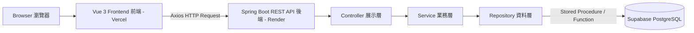
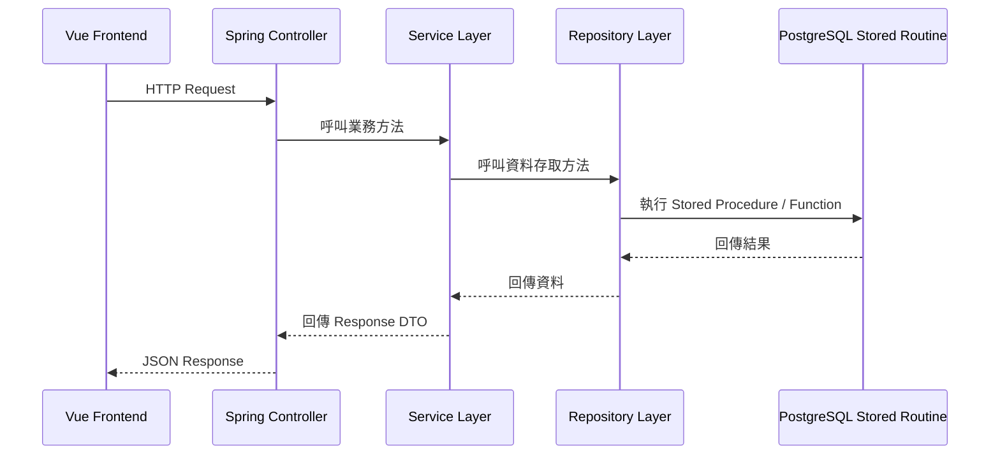
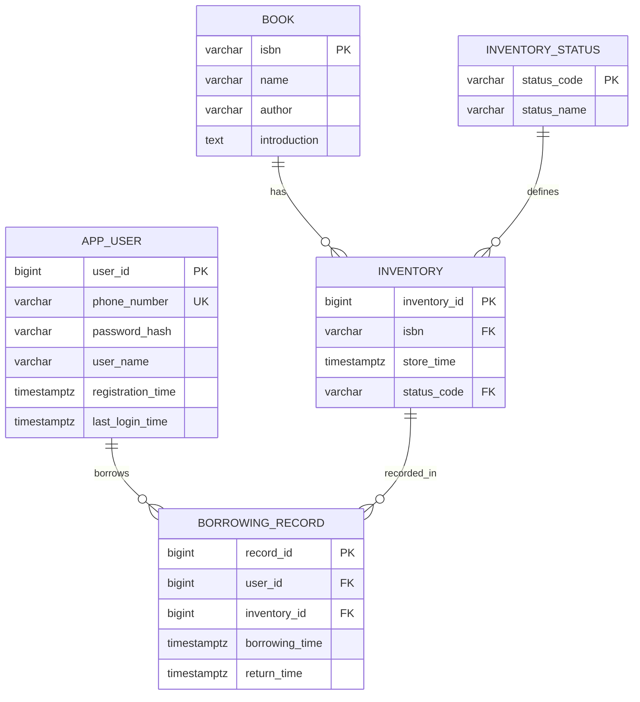
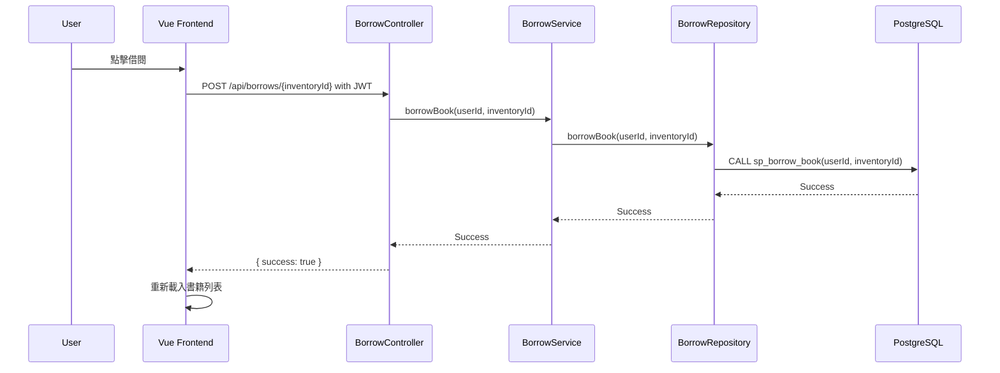

# ESUN Library Borrowing System 圖書借閱系統

**作者：** Jimmy Chang（張祐豪）  
**所屬單位：** 國立中央大學 資電學院 網路學習科技研究所  

> 本專案是一個以 **Vue 3、Spring Boot、PostgreSQL** 建立的全端線上圖書借閱系統。  
> 系統支援使用者註冊、登入驗證、書籍查詢、借書、還書、JWT 授權、Stored Procedure、Transaction 控制、基本資安防護與雲端部署。

---

## 線上展示

| 項目 | 連結 |
|---|---|
| Frontend Demo | https://esun-library-system.vercel.app |
| Backend API | https://esun-library-system.onrender.com/api/books |
| GitHub Repository | https://github.com/a88019401/esun-library-system |

> 備註：後端部署於 Render Free Plan，若服務進入休眠狀態，第一次請求可能需要等待數十秒喚醒。  
> 若前端第一次載入書籍列表較慢，通常是 Render 後端正在喚醒，重新整理或等待片刻即可。

---

## 目錄

1. [專案簡介](#1-專案簡介)
2. [系統功能](#2-系統功能)
3. [技術架構](#3-技術架構)
4. [系統三層式架構](#4-系統三層式架構)
5. [後端分層架構](#5-後端分層架構)
6. [專案結構](#6-專案結構)
7. [資料庫設計](#7-資料庫設計)
8. [Stored Procedure / Function 設計](#8-stored-procedure--function-設計)
9. [API 文件](#9-api-文件)
10. [前端操作說明](#10-前端操作說明)
11. [環境變數設定](#11-環境變數設定)
12. [專案啟動方式](#12-專案啟動方式)
13. [雲端部署說明](#13-雲端部署說明)
14. [Build Test 編譯測試](#14-build-test-編譯測試)
15. [手動測試清單](#15-手動測試清單)
16. [安全性設計](#16-安全性設計)
17. [Transaction 交易設計](#17-transaction-交易設計)
18. [需求對應表](#18-需求對應表)
19. [實作流程說明](#19-實作流程說明)
20. [目前限制與未來優化](#20-目前限制與未來優化)
21. [Final Status 最終狀態](#final-status-最終狀態)
22. [License](#license)

---

## 1. 專案簡介

本專案為線上圖書借閱系統，使用者可以透過手機號碼註冊帳號，登入後取得 JWT Token，接著可以瀏覽目前館藏、借閱書籍與歸還書籍。

系統採用前後端分離架構：

```text
瀏覽器
→ Vue 前端
→ Spring Boot REST API
→ Stored Procedure / Function
→ Supabase PostgreSQL
```

雲端部署後的正式架構為：

```text
Browser
→ Vue Frontend on Vercel
→ Spring Boot Backend on Render
→ Supabase PostgreSQL
```

後端主要負責：

- 使用者註冊
- BCrypt 密碼雜湊
- 使用者登入
- JWT 產生與驗證
- 書籍列表查詢
- 借書與還書
- Transaction 交易控制
- 呼叫資料庫 Stored Procedure / Function
- 使用 Spring Security 保護 API
- 使用參數綁定降低 SQL Injection 風險
- 設定 CORS 讓前端可以呼叫後端 API

前端主要負責：

- 顯示書籍列表
- 使用者註冊
- 使用者登入
- 儲存 JWT Token
- 自動將 JWT Token 加入受保護 API 的 Request Header
- 透過 UI 操作借書與還書
- 未登入時導向登入頁
- 僅讓目前借閱者看到「還書」操作

---

## 2. 系統功能

| 功能 | 狀態 | 說明 |
|---|---:|---|
| 使用者註冊 | 已完成 | 使用者可使用手機號碼、密碼與名稱註冊 |
| 手機號碼不可重複 | 已完成 | 資料庫限制手機號碼唯一 |
| 密碼雜湊 | 已完成 | 使用 BCrypt 儲存密碼 Hash，不儲存明碼 |
| 使用者登入 | 已完成 | 使用手機號碼與密碼登入 |
| JWT 授權 | 已完成 | 登入成功後由後端回傳 JWT |
| 書籍列表 | 已完成 | 使用者可瀏覽所有館藏與狀態 |
| 借書功能 | 已完成 | 登入使用者可借閱可借閱狀態的書籍 |
| 還書功能 | 已完成 | 登入使用者可歸還自己借閱的書籍 |
| 非借閱者還書限制 | 已完成 | 其他使用者看到已借出書籍時，僅顯示「已借出」 |
| Transaction | 已完成 | 借書與還書流程使用交易控制 |
| Stored Procedure | 已完成 | 資料存取透過 Stored Procedure / Function |
| RESTful API | 已完成 | 後端以 REST 風格設計 API |
| 後端分層 | 已完成 | Controller、Service、Repository、Common/Security 分層 |
| Vue 前端 | 已完成 | 使用 Vue 3 完成前端操作介面 |
| CORS | 已完成 | 前端可跨 Port / 跨網域呼叫後端 API |
| SQL Injection 防護 | 已完成 | 使用 JdbcTemplate 參數綁定 |
| XSS 基礎防護 | 已完成 | 前端使用 Vue 插值語法，未使用 `v-html` |
| 前端雲端部署 | 已完成 | Vue 前端部署於 Vercel |
| 後端雲端部署 | 已完成 | Spring Boot 後端透過 Docker 部署於 Render |
| 雲端資料庫 | 已完成 | 使用 Supabase PostgreSQL |

---

## 3. 技術架構

### 3.1 前端技術

| 類別 | 技術 |
|---|---|
| Framework | Vue 3 |
| Build Tool | Vite |
| Router | Vue Router |
| HTTP Client | Axios |
| 狀態儲存 | localStorage |
| Styling | CSS |
| Formatting | Prettier |
| Linting | ESLint |
| Deployment | Vercel |

### 3.2 後端技術

| 類別 | 技術 |
|---|---|
| Language | Java 17 |
| Framework | Spring Boot 3.5.14 |
| Build Tool | Maven |
| Web Server / Runtime | Embedded Tomcat |
| Security | Spring Security |
| Authentication | JWT |
| Password Hashing | BCrypt |
| Database Access | Spring JDBC / JdbcTemplate |
| Transaction | Spring `@Transactional` |
| Containerization | Docker |
| Deployment | Render |

### 3.3 資料庫技術

| 類別 | 技術 |
|---|---|
| Database | Supabase PostgreSQL |
| Data Model | Relational Database |
| Data Access | Stored Procedure / Function |
| Connection | Supabase Pooler / Supavisor |
| Integrity | Primary Key、Foreign Key、Unique Constraint、Check Constraint、Index |

---

## 4. 系統三層式架構

本專案符合 Web Server + Application Server + Relational Database 的三層式架構，並已完成雲端部署。

| 架構層級 | 本專案實作 | 部署環境 | 職責 |
|---|---|---|---|
| Web Server / Frontend Layer | Vue 3 + Vite | Vercel | 提供使用者操作介面，透過 Axios 呼叫後端 API |
| Application Server Layer | Spring Boot + Embedded Tomcat | Render Docker Web Service | 提供 RESTful API、登入驗證、業務邏輯與 Transaction 控制 |
| Relational Database Layer | Supabase PostgreSQL | Supabase Cloud | 儲存使用者、書籍、庫存與借閱紀錄 |

### 4.1 系統架構圖



### 4.2 開發環境 Port

```text
Frontend: http://localhost:5173
Backend:  http://localhost:8080
Database: Supabase PostgreSQL
```

### 4.3 雲端部署環境

```text
Frontend: https://esun-library-system.vercel.app
Backend:  https://esun-library-system.onrender.com
Database: Supabase PostgreSQL via Connection Pooler
```

---

## 5. 後端分層架構

後端依照展示層、業務層、資料層與共用層設計。

| 後端層級 | Package | 主要檔案 | 職責 |
|---|---|---|---|
| 展示層 | `controller` | `AuthController`, `BookController`, `BorrowController` | 接收 HTTP Request 並回傳 API Response |
| 業務層 | `service` | `AuthService`, `BookService`, `BorrowService` | 處理註冊、登入、借書、還書與 Transaction |
| 資料層 | `repository` | `UserRepository`, `BookRepository`, `BorrowRepository` | 使用 JdbcTemplate 呼叫 Stored Procedure / Function |
| 共用層 | `common`, `dto`, `security`, `config` | `GlobalExceptionHandler`, `ApiResponse`, `JwtUtil`, `SecurityConfig` | 共用回應、例外處理、安全設定與 JWT 工具 |

### 5.1 後端呼叫流程



---

## 6. 專案結構

```text
esun-library-system/
├── backend/
│   ├── DB/
│   │   ├── 01_schema.sql
│   │   ├── 02_routines.sql
│   │   └── 03_seed.sql
│   │
│   ├── Dockerfile
│   │
│   ├── src/main/java/com/esun/library/
│   │   ├── common/
│   │   │   └── GlobalExceptionHandler.java
│   │   │
│   │   ├── config/
│   │   │   └── SecurityConfig.java
│   │   │
│   │   ├── controller/
│   │   │   ├── AuthController.java
│   │   │   ├── BookController.java
│   │   │   └── BorrowController.java
│   │   │
│   │   ├── dto/
│   │   ├── entity/
│   │   ├── repository/
│   │   ├── security/
│   │   ├── service/
│   │   └── LibraryApplication.java
│   │
│   ├── src/main/resources/
│   │   └── application.yml
│   │
│   ├── README_BACKEND.md
│   ├── pom.xml
│   ├── mvnw
│   └── mvnw.cmd
│
├── frontend/
│   ├── src/
│   │   ├── api/
│   │   │   └── http.js
│   │   ├── router/
│   │   │   └── index.js
│   │   ├── views/
│   │   │   ├── BookListView.vue
│   │   │   ├── LoginView.vue
│   │   │   └── RegisterView.vue
│   │   ├── App.vue
│   │   ├── main.js
│   │   └── style.css
│   │
│   ├── README_FRONTEND.md
│   ├── package.json
│   └── vite.config.js
│
├── README.md
├── README_en.md
├── LICENSE
└── .gitignore
```

---

## 7. 資料庫設計

資料庫 SQL 檔案存放於：

```text
backend/DB/
```

執行順序：

```text
01_schema.sql
02_routines.sql
03_seed.sql
```

### 7.1 主要資料表

| Table | 說明 |
|---|---|
| `app_user` | 使用者資料 |
| `book` | 書籍主檔 |
| `inventory_status` | 庫存狀態代碼 |
| `inventory` | 實體館藏庫存 |
| `borrowing_record` | 借閱與歸還紀錄 |

### 7.2 ER Diagram



### 7.3 Book 與 Inventory 的設計說明

本系統將 `book` 與 `inventory` 拆開：

```text
book      = 書籍主檔，例如書名、作者、ISBN、簡介
inventory = 實體館藏，例如同一本書的第 1 本、第 2 本
```

因此同一本書可以有多筆實體庫存。例如兩本 `Clean Code` 可以共用同一個 ISBN，但擁有不同的 `inventory_id`。這樣的設計較符合圖書館實務，也符合資料庫正規化概念。

---

## 8. Stored Procedure / Function 設計

| Routine | 類型 | 功能 |
|---|---|---|
| `fn_list_books(p_user_id)` | Function | 查詢書籍與庫存列表，並回傳目前使用者是否為借閱者 |
| `fn_find_user_by_phone(phone)` | Function | 依手機號碼查詢使用者 |
| `sp_register_user(phone, passwordHash, userName)` | Procedure | 註冊使用者 |
| `sp_update_last_login(userId)` | Procedure | 更新最後登入時間 |
| `sp_borrow_book(userId, inventoryId)` | Procedure | 借書 |
| `sp_return_book(userId, inventoryId)` | Procedure | 還書 |

後端透過 Repository 層呼叫這些資料庫 Routine，而不是在 Controller 中直接撰寫 SQL。

範例：

```java
jdbcTemplate.update(
    "CALL sp_borrow_book(?, ?)",
    userId,
    inventoryId
);
```

### 8.1 `borrowed_by_me` 設計

為避免非借閱者看到「還書」按鈕，`fn_list_books(p_user_id)` 會回傳：

```text
borrowed_by_me
```

後端轉換為：

```text
borrowedByMe
```

前端根據此欄位判斷：

| 狀態 | 是否本人借閱 | 顯示 |
|---|---:|---|
| AVAILABLE | 無關 | 借閱 |
| BORROWED | true | 還書 |
| BORROWED | false | 已借出 |

---

## 9. API 文件

Base URL：

```text
Local:      http://localhost:8080/api
Production: https://esun-library-system.onrender.com/api
```

### 9.1 查詢書籍列表

```http
GET /api/books
```

是否需要登入：否

Response 範例：

```json
[
  {
    "inventoryId": 1,
    "isbn": "9789865020011",
    "name": "Clean Code",
    "author": "Robert C. Martin",
    "introduction": "A handbook of agile software craftsmanship.",
    "status": "AVAILABLE",
    "borrowedByMe": false
  }
]
```

---

### 9.2 註冊

```http
POST /api/auth/register
Content-Type: application/json
```

是否需要登入：否

Request：

```json
{
  "phoneNumber": "0912345679",
  "password": "password123",
  "userName": "Jimmy"
}
```

Response：

```json
{
  "success": true,
  "message": "註冊成功"
}
```

驗證規則：

| 欄位 | 規則 |
|---|---|
| `phoneNumber` | 必填，需符合台灣手機格式 `09xxxxxxxx` |
| `password` | 必填，至少 8 碼 |
| `userName` | 必填 |

---

### 9.3 登入

```http
POST /api/auth/login
Content-Type: application/json
```

是否需要登入：否

Request：

```json
{
  "phoneNumber": "0912345679",
  "password": "password123"
}
```

Response：

```json
{
  "token": "eyJhbGciOiJIUzM4NCJ9...",
  "tokenType": "Bearer",
  "userName": "Jimmy"
}
```

---

### 9.4 借書

```http
POST /api/borrows/{inventoryId}
Authorization: Bearer <JWT_TOKEN>
```

是否需要登入：是

Response：

```json
{
  "success": true,
  "message": "借閱成功"
}
```

借書成功後：

```text
inventory.status_code = BORROWED
borrowing_record 新增一筆 return_time = NULL 的借閱紀錄
```

---

### 9.5 還書

```http
POST /api/borrows/{inventoryId}/return
Authorization: Bearer <JWT_TOKEN>
```

是否需要登入：是

Response：

```json
{
  "success": true,
  "message": "還書成功"
}
```

還書成功後：

```text
inventory.status_code = AVAILABLE
borrowing_record.return_time 更新為歸還時間
```

---

## 10. 前端操作說明

### 10.1 開啟系統

本機開發環境：

```text
http://localhost:5173
```

線上部署環境：

```text
https://esun-library-system.vercel.app
```

系統會自動導向：

```text
/books
```

---

### 10.2 查看書籍列表

書籍列表會顯示：

- 書名
- 作者
- ISBN
- 庫存編號
- 書籍簡介
- 目前狀態

狀態說明：

| 狀態 | 意義 |
|---|---|
| `AVAILABLE` | 可借閱 |
| `BORROWED` | 已借出 |

---

### 10.3 註冊

開啟：

```text
/register
```

輸入：

```text
使用者名稱
手機號碼
密碼
```

註冊成功後，系統會導向登入頁。

---

### 10.4 登入

開啟：

```text
/login
```

登入成功後：

```text
1. 後端回傳 JWT
2. 前端將 JWT 存入 localStorage
3. 前端將 userName 存入 localStorage
4. Navbar 顯示使用者名稱
5. 使用者被導向 /books
```

---

### 10.5 借書

操作流程：

```text
1. 登入系統
2. 進入 /books
3. 對 AVAILABLE 書籍點擊「借閱」
4. 書籍狀態變為 BORROWED
```

---

### 10.6 還書

操作流程：

```text
1. 登入系統
2. 進入 /books
3. 若該書籍為目前登入者本人借閱，會顯示「還書」
4. 點擊「還書」後，書籍狀態變回 AVAILABLE
```

若書籍已被其他使用者借閱，前端會顯示：

```text
已借出
```

---

### 10.7 登出

點擊 Navbar 右上角的「登出」按鈕。

前端會清除：

```text
localStorage.token
localStorage.userName
```

---

## 11. 環境變數設定

### 11.1 Backend `.env`：本機開發

建立：

```text
backend/.env
```

範例：

```properties
DB_URL=jdbc:postgresql://db.<your-project-id>.supabase.co:5432/postgres?sslmode=require
DB_USERNAME=postgres
DB_PASSWORD=your_database_password

JWT_SECRET=your-jwt-secret-at-least-32-characters
JWT_EXPIRATION_MS=86400000
```

---

### 11.2 Backend Environment Variables：Render

Render 後端使用 Supabase Pooler / Supavisor 連線：

```properties
DB_URL=jdbc:postgresql://aws-1-ap-northeast-1.pooler.supabase.com:5432/postgres?sslmode=require
DB_USERNAME=postgres.<project-ref>
DB_PASSWORD=your_database_password

JWT_SECRET=your-jwt-secret-at-least-32-characters
JWT_EXPIRATION_MS=86400000
```

> 實際密碼不會提交至 GitHub。

---

### 11.3 Frontend `.env`：本機開發

建立：

```text
frontend/.env
```

範例：

```properties
VITE_API_BASE_URL=http://localhost:8080/api
```

---

### 11.4 Frontend Environment Variables：Vercel

Vercel 前端環境變數：

```properties
VITE_API_BASE_URL=https://esun-library-system.onrender.com/api
```

> Vite 的 `VITE_*` 變數會在 build 階段寫入前端 bundle，因此在 Vercel 修改環境變數後需要重新部署。

---

### 11.5 注意事項

`.env` 包含敏感資料，不應上傳到 GitHub。

建議 `.gitignore` 包含：

```gitignore
.env
backend/.env
frontend/.env
target/
backend/target/
frontend/dist/
node_modules/
frontend/node_modules/
```

---

## 12. 專案啟動方式

### 12.1 啟動後端

```powershell
cd backend
.\mvnw.cmd spring-boot:run
```

後端網址：

```text
http://localhost:8080
```

快速測試：

```text
http://localhost:8080/api/books
```

---

### 12.2 啟動前端

```powershell
cd frontend
npm install
npm run dev
```

前端網址：

```text
http://localhost:5173
```

---

## 13. 雲端部署說明

本專案已完成前端、後端與資料庫雲端部署：

```text
Frontend：Vercel
Backend：Render
Database：Supabase PostgreSQL
```

### 13.1 Frontend Deployment：Vercel

前端部署於 Vercel，部署設定如下：

| 設定項目 | 設定值 |
|---|---|
| Framework | Vite |
| Root Directory | `frontend` |
| Build Command | `npm run build` |
| Output Directory | `dist` |
| Environment Variable | `VITE_API_BASE_URL=https://esun-library-system.onrender.com/api` |

Vercel 前端網址：

```text
https://esun-library-system.vercel.app
```

---

### 13.2 Backend Deployment：Render

後端部署於 Render。由於部署時未使用 Java Runtime 選項，因此採用 Docker 部署 Spring Boot。

Render 部署設定如下：

| 設定項目 | 設定值 |
|---|---|
| Runtime | Docker |
| Root Directory | `backend` |
| Dockerfile Path | `Dockerfile` |
| Backend URL | `https://esun-library-system.onrender.com` |

後端測試 API：

```text
https://esun-library-system.onrender.com/api/books
```

---

### 13.3 Dockerfile

後端使用 multi-stage Docker build：

```dockerfile
FROM maven:3.9.9-eclipse-temurin-17 AS build
WORKDIR /app
COPY . .
RUN chmod +x mvnw && ./mvnw clean package -DskipTests

FROM eclipse-temurin:17-jre
WORKDIR /app
COPY --from=build /app/target/*.jar app.jar
ENV PORT=8080
EXPOSE 8080
ENTRYPOINT ["java", "-jar", "app.jar"]
```

---

### 13.4 Supabase Pooler 說明

部署時曾發現 Render 後端無法透過 Supabase Direct Connection 連線資料庫，錯誤訊息為：

```json
{
  "success": false,
  "message": "Network is unreachable"
}
```

後續改用 Supabase Connection Pooler / Supavisor：

```text
aws-1-ap-northeast-1.pooler.supabase.com:5432
```

修正後 Render 後端即可成功連線 Supabase PostgreSQL。

---

### 13.5 Render Free Plan 注意事項

Render Free Plan 服務可能在閒置後休眠。  
若長時間未使用，第一次開啟前端或呼叫 API 時可能需要等待後端喚醒。

---

## 14. Build Test 編譯測試

### 14.1 後端 Build

```powershell
cd backend
.\mvnw.cmd clean package
```

預期結果：

```text
BUILD SUCCESS
```

Build 產物：

```text
backend/target/
```

---

### 14.2 執行後端 Jar

```powershell
java -jar target/library-0.0.1-SNAPSHOT.jar
```

接著開啟：

```text
http://localhost:8080/api/books
```

---

### 14.3 前端 Format

```powershell
cd frontend
npm run format
```

---

### 14.4 前端 Build

```powershell
npm run build
```

預期產生：

```text
frontend/dist/
```

---

### 14.5 前端 Preview

```powershell
npm run preview
```

預設網址：

```text
http://localhost:4173
```

若使用 preview 模式，後端 CORS 需允許：

```text
http://localhost:4173
http://127.0.0.1:4173
```

---

## 15. 手動測試清單

| 測試項目 | 預期結果 |
|---|---|
| 開啟 `/books` | 顯示書籍列表 |
| 註冊新使用者 | 使用者建立成功並導向登入 |
| 登入 | JWT token 被儲存，Navbar 顯示使用者名稱 |
| 借閱 AVAILABLE 書籍 | 書籍狀態變為 BORROWED |
| 歸還本人借閱的 BORROWED 書籍 | 書籍狀態變回 AVAILABLE |
| 其他使用者查看已借出書籍 | 顯示「已借出」，不可還書 |
| 登出 | token 與 userName 被清除 |
| 未登入借書 | 導向登入頁 |
| 不帶 JWT 呼叫借書 API | 後端回傳 403 |
| 直接開啟後端 `/api/books` | 回傳 JSON 書籍列表 |
| 後端 Build | 顯示 `BUILD SUCCESS` |
| 前端 Build | 產生 `dist/` 資料夾 |
| Vercel 前端 | 可正常顯示畫面並呼叫 Render API |
| Render 後端 | `/api/books` 可回傳資料 |

---

## 16. 安全性設計

### 16.1 密碼安全

密碼在儲存前會透過 BCrypt 進行雜湊：

```java
passwordEncoder.encode(request.getPassword())
```

資料庫只儲存：

```text
password_hash
```

不儲存明碼密碼。

---

### 16.2 JWT 身分驗證

登入成功後，後端會回傳 JWT Token。

受保護 API 需要帶入：

```http
Authorization: Bearer <JWT_TOKEN>
```

後端會從 JWT 中解析使用者身份，不信任前端自行傳入的 userId。

---

### 16.3 SQL Injection 防護

後端所有資料庫操作皆透過 `JdbcTemplate` 參數綁定：

```java
jdbcTemplate.update(
    "CALL sp_return_book(?, ?)",
    userId,
    inventoryId
);
```

不使用字串拼接 SQL。

---

### 16.4 XSS 防護

前端使用 Vue 插值語法：

```vue
{{ book.name }}
{{ book.author }}
{{ book.introduction }}
```

本專案未使用 `v-html` 顯示使用者可控內容，可降低 XSS 風險。

---

### 16.5 CORS

後端允許可信任的前端來源：

```text
http://localhost:5173
http://127.0.0.1:5173
http://localhost:4173
http://127.0.0.1:4173
https://esun-library-system.vercel.app
```

此設定讓本機開發環境、Vite Preview 環境與 Vercel 部署環境皆可正常呼叫後端 API，同時受保護 API 仍需 JWT 驗證。

---

## 17. Transaction 交易設計

借書與還書都會同時異動多筆資料。

### 17.1 借書流程

```text
1. 檢查 inventory 狀態是否為 AVAILABLE
2. 將 inventory.status_code 更新為 BORROWED
3. 新增 borrowing_record，return_time 為 NULL
```

### 17.2 還書流程

```text
1. 檢查 inventory 狀態是否為 BORROWED
2. 查詢尚未歸還的 borrowing_record
3. 將 inventory.status_code 更新為 AVAILABLE
4. 更新 borrowing_record.return_time
```

Service 方法使用 `@Transactional`：

```java
@Transactional
public void borrowBook(Long userId, Long inventoryId) {
    borrowRepository.borrowBook(userId, inventoryId);
}
```

```java
@Transactional
public void returnBook(Long userId, Long inventoryId) {
    borrowRepository.returnBook(userId, inventoryId);
}
```

若任一步驟失敗，交易會 rollback，避免資料不一致。

### 17.3 借書流程圖



---

## 18. 需求對應表

| 需求面向 | 本專案實作 |
|---|---|
| Web Server + Application Server + Relational Database | Vue 前端 + Spring Boot 後端 + PostgreSQL |
| 前端技術 | Vue 3 |
| 後端技術 | Spring Boot |
| RESTful API | `/api/books`, `/api/auth/*`, `/api/borrows/*` |
| 專案建置工具 | 後端 Maven，前端 Vite/npm |
| Stored Procedure 存取資料庫 | Repository 層呼叫 PostgreSQL Routine |
| Transaction | 借書與還書 Service 使用 `@Transactional` |
| DDL / DML 資料夾 | SQL 檔案存放於 `backend/DB/` |
| SQL Injection 防護 | JdbcTemplate 參數綁定 |
| XSS 防護 | Vue 插值語法，未使用 `v-html` |
| 展示層 | `controller` package |
| 業務層 | `service` package |
| 資料層 | `repository` package |
| 共用層 | `common`, `dto`, `security`, `config` packages |
| 借還書需登入 | Spring Security + JWT |
| 密碼加鹽與雜湊 | BCrypt |
| 前端雲端部署 | Vercel |
| 後端雲端部署 | Render Docker Web Service |
| 雲端資料庫 | Supabase PostgreSQL |

---

## 19. 實作流程說明

### Step 1：設計資料庫

將書籍主檔與實體庫存拆開：

```text
book      = 書名、作者、ISBN、簡介
inventory = 每一本實體館藏
```

這樣同一本書可以有多本庫存。

### Step 2：建立 Stored Routine

系統將主要資料庫操作集中在 Stored Procedure / Function：

```text
fn_list_books()
sp_register_user()
sp_borrow_book()
sp_return_book()
```

這讓資料庫操作更集中，也讓 Java 程式碼更乾淨。

### Step 3：建立 Spring Boot 後端

後端採用：

```text
Controller → Service → Repository → Database
```

每一層職責清楚分離。

### Step 4：實作登入驗證

註冊時只儲存密碼 Hash。  
登入時使用 BCrypt 比對密碼。  
登入成功後產生 JWT。

### Step 5：保護借書與還書 API

Spring Security 公開：

```text
/api/books
/api/auth/register
/api/auth/login
```

其他 API 需 JWT Token。

### Step 6：實作 Vue 前端

前端提供：

```text
/books
/login
/register
```

並透過 Axios 呼叫後端 API。

### Step 7：儲存與帶入 JWT

登入後，Token 會被存入 `localStorage`。

Axios interceptor 會自動加上：

```http
Authorization: Bearer <token>
```

### Step 8：完成借書與還書

前端呼叫受保護 API。  
後端驗證 Token。  
資料庫透過 Transaction 更新 `inventory` 與 `borrowing_record`。

### Step 9：部署前端與後端

```text
Vue 前端 → Vercel
Spring Boot 後端 → Render Docker Web Service
PostgreSQL 資料庫 → Supabase
```

### Step 10：修正部署與權限細節

部署後補上：

- Vercel 環境變數 `VITE_API_BASE_URL`
- Render 環境變數 `DB_URL`, `DB_USERNAME`, `DB_PASSWORD`, `JWT_SECRET`
- CORS 放行 Vercel domain
- Supabase Pooler 連線
- `borrowedByMe` 判斷，避免非借閱者看到還書按鈕

---

## 20. 目前限制與未來優化

| 項目 | 說明 |
|---|---|
| 我的借閱紀錄 | 未來可新增顯示目前使用者的借閱歷史 |
| 管理員功能 | 未來可新增書籍新增、修改、刪除與庫存管理 |
| Token Refresh | 尚未實作 Refresh Token |
| 測試覆蓋率 | 未來可補單元測試與整合測試 |
| CI/CD | 目前已完成手動部署，未來可加入 GitHub Actions 自動測試與部署流程 |
| UI 優化 | 可加入 Toast、Modal、Loading Skeleton、Pagination |
| TypeScript | 前端未來可改用 TypeScript 增加型別安全 |

---

## Final Status 最終狀態

```text
Backend MVP: Completed
Frontend MVP: Completed
Full-stack Core Flow: Completed
Final Documentation: Completed
Build Test: Completed
Cloud Deployment: Completed
```

本系統已完成核心流程：

```text
註冊
→ 登入
→ JWT 驗證
→ 查看書籍
→ 借閱書籍
→ 更新庫存狀態
→ 歸還書籍
→ 更新借閱紀錄
→ 前端 Vercel 部署
→ 後端 Render 部署
→ Supabase PostgreSQL 串接
```

本專案已具備完整全端圖書借閱系統 MVP，可進行最終測試、展示與後續擴充。

---

## License

Copyright © 2026 Jimmy Chang（張祐豪）.  
All Rights Reserved.

This project is provided for interview review and evaluation purposes only. Unauthorized copying, distribution, modification, or commercial use is not permitted.
