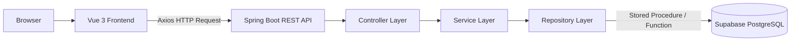
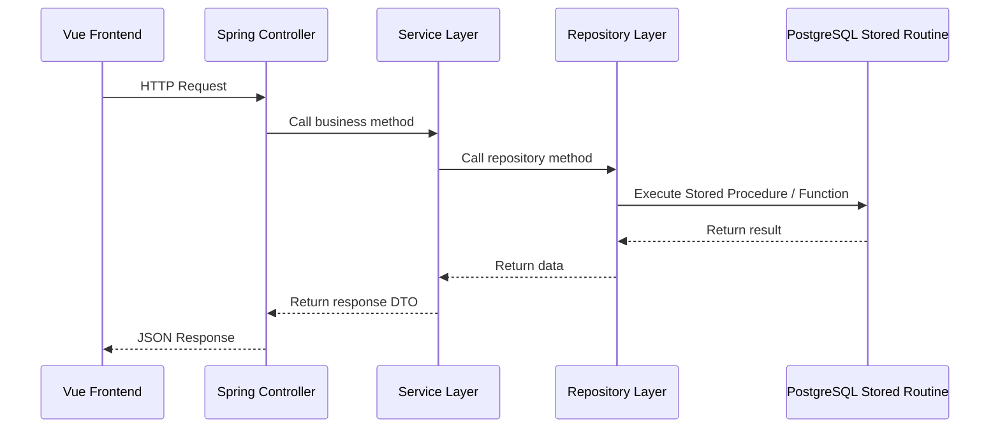
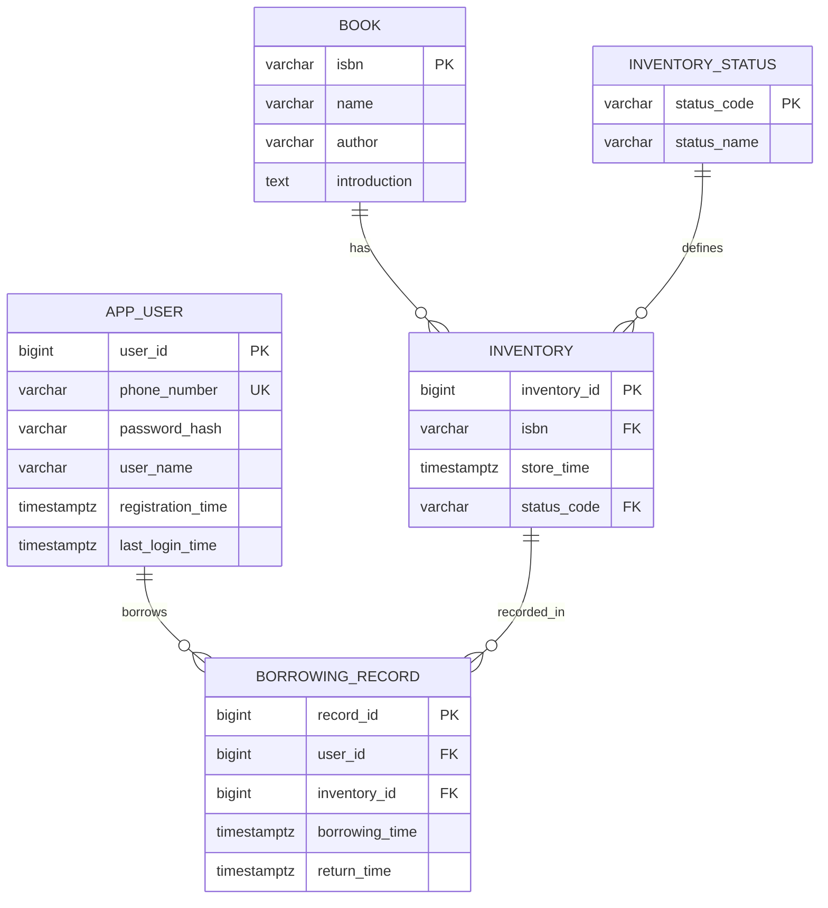
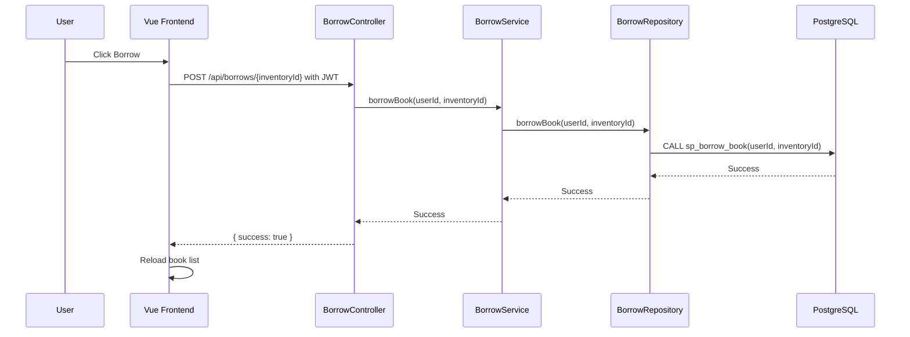

# ESUN Library Borrowing System
**Author:** Jimmy Chang（張祐豪）  
**Affiliation:** National Central University, College of Electrical Engineering and Computer Science, Graduate Institute of Network Learning Technology.
> A full-stack online library borrowing system built with **Vue 3**, **Spring Boot**, and **PostgreSQL**.  
> The system supports user registration, login authentication, book listing, book borrowing, book returning, JWT authorization, stored procedures, transaction control, and basic security protections.

---

## Table of Contents

1. [Project Overview](#1-project-overview)
2. [Key Features](#2-key-features)
3. [Technology Stack](#3-technology-stack)
4. [System Architecture](#4-system-architecture)
5. [Backend Layered Architecture](#5-backend-layered-architecture)
6. [Project Structure](#6-project-structure)
7. [Database Design](#7-database-design)
8. [Stored Procedures and Functions](#8-stored-procedures-and-functions)
9. [API Documentation](#9-api-documentation)
10. [Frontend Usage Guide](#10-frontend-usage-guide)
11. [Environment Variables](#11-environment-variables)
12. [How to Run the Project](#12-how-to-run-the-project)
13. [Build Test](#13-build-test)
14. [Manual Test Checklist](#14-manual-test-checklist)
15. [Security Design](#15-security-design)
16. [Transaction Design](#16-transaction-design)
17. [Requirement Mapping](#17-requirement-mapping)
18. [Learning Notes / Implementation Walkthrough](#18-learning-notes--implementation-walkthrough)
19. [Known Limitations and Future Improvements](#19-known-limitations-and-future-improvements)

---

## 1. Project Overview

This project is an online library borrowing system. Users can register an account with a phone number, log in to receive a JWT token, browse all available book inventory, borrow books, and return books.

The system follows a frontend-backend separated architecture:

```text
Browser
→ Vue Frontend
→ Spring Boot REST API
→ Stored Procedure / Function
→ Supabase PostgreSQL
```

The main backend responsibilities are:

- User registration
- Password hashing with BCrypt
- User login
- JWT generation and validation
- Book listing
- Borrowing and returning books
- Transactional data updates
- Calling database stored routines
- Protecting APIs with Spring Security
- Preventing SQL Injection through parameter binding
- Supporting CORS for frontend integration

The main frontend responsibilities are:

- Display book list
- Register user
- Log in user
- Store JWT token
- Automatically attach JWT token to protected API requests
- Borrow and return books from the UI
- Redirect unauthenticated users to the login page

---

## 2. Key Features

| Feature | Status | Description |
|---|---:|---|
| User Registration | Completed | Users register with phone number, password, and username |
| Duplicate Phone Check | Completed | Phone number is unique in the database |
| Password Hashing | Completed | Passwords are stored with BCrypt hash |
| Login Authentication | Completed | Users log in with phone number and password |
| JWT Authorization | Completed | Backend returns JWT after login |
| Book Listing | Completed | Users can browse book inventory |
| Borrow Book | Completed | Logged-in users can borrow available books |
| Return Book | Completed | Logged-in users can return borrowed books |
| Transaction | Completed | Borrow and return operations are transactional |
| Stored Procedure | Completed | Database operations are accessed via stored routines |
| RESTful API | Completed | Backend APIs follow REST-style endpoints |
| Layered Backend | Completed | Controller, Service, Repository, Common/Security layers |
| Vue Frontend | Completed | Frontend implemented with Vue 3 |
| CORS | Completed | Frontend can call backend across different ports |
| SQL Injection Protection | Completed | Uses JdbcTemplate parameter binding |
| XSS Basic Protection | Completed | Vue interpolation is used; no `v-html` |

---

## 3. Technology Stack

### Frontend

| Category | Technology |
|---|---|
| Framework | Vue 3 |
| Build Tool | Vite |
| Router | Vue Router |
| HTTP Client | Axios |
| State Storage | localStorage |
| Styling | CSS |
| Formatting | Prettier |
| Linting | ESLint |

### Backend

| Category | Technology |
|---|---|
| Language | Java 17 |
| Framework | Spring Boot 3.5.14 |
| Build Tool | Maven |
| Web Server / Runtime | Embedded Tomcat |
| Security | Spring Security |
| Authentication | JWT |
| Password Hashing | BCrypt |
| Database Access | Spring JDBC / JdbcTemplate |
| Transaction | Spring `@Transactional` |

### Database

| Category | Technology |
|---|---|
| Database | Supabase PostgreSQL |
| Data Model | Relational Database |
| Data Access | Stored Procedure / Function |
| Integrity | Primary Key, Foreign Key, Unique Constraint, Check Constraint, Index |

---

## 4. System Architecture

This project follows a three-tier architecture:

| Architecture Layer | Implementation | Responsibility |
|---|---|---|
| Web Server / Frontend Layer | Vue 3 + Vite | Provides user interface and calls backend APIs through Axios |
| Application Server Layer | Spring Boot + Embedded Tomcat | Provides RESTful APIs, authentication, business logic, and transaction control |
| Relational Database Layer | Supabase PostgreSQL | Stores users, books, inventory, and borrowing records |

### Architecture Diagram



### Development Environment Ports

```text
Frontend: http://localhost:5173
Backend:  http://localhost:8080
Database: Supabase PostgreSQL
```

### Production Note

During development, the Vue app is served by Vite.  
In production, the frontend can be built into static files under `frontend/dist/` and served by a web server such as Nginx, Apache, or any static hosting service. Spring Boot remains the application server for backend APIs.

---

## 5. Backend Layered Architecture

The backend is organized into presentation, business, data access, and common/security layers.

| Required Layer | Package | Main Files | Responsibility |
|---|---|---|---|
| Presentation Layer | `controller` | `AuthController`, `BookController`, `BorrowController` | Receives HTTP requests and returns API responses |
| Business Layer | `service` | `AuthService`, `BookService`, `BorrowService` | Handles business rules, login logic, borrowing logic, and transaction control |
| Data Access Layer | `repository` | `UserRepository`, `BookRepository`, `BorrowRepository` | Calls stored procedures/functions using JdbcTemplate |
| Common Layer | `common`, `dto`, `security`, `config` | `GlobalExceptionHandler`, `ApiResponse`, `JwtUtil`, `SecurityConfig` | Handles shared responses, exception handling, JWT, and security configuration |

### Backend Call Flow



---

## 6. Project Structure

```text
esun-library-system/
├── backend/
│   ├── DB/
│   │   ├── 01_schema.sql
│   │   ├── 02_routines.sql
│   │   └── 03_seed.sql
│   │
│   ├── src/main/java/com/esun/library/
│   │   ├── common/
│   │   │   └── GlobalExceptionHandler.java
│   │   │
│   │   ├── config/
│   │   │   └── SecurityConfig.java
│   │   │
│   │   ├── controller/
│   │   │   ├── AuthController.java
│   │   │   ├── BookController.java
│   │   │   └── BorrowController.java
│   │   │
│   │   ├── dto/
│   │   │   ├── ApiResponse.java
│   │   │   ├── BookResponse.java
│   │   │   ├── LoginRequest.java
│   │   │   ├── LoginResponse.java
│   │   │   └── RegisterRequest.java
│   │   │
│   │   ├── entity/
│   │   │   └── AppUser.java
│   │   │
│   │   ├── repository/
│   │   │   ├── BookRepository.java
│   │   │   ├── BorrowRepository.java
│   │   │   └── UserRepository.java
│   │   │
│   │   ├── security/
│   │   │   ├── JwtAuthenticationFilter.java
│   │   │   └── JwtUtil.java
│   │   │
│   │   ├── service/
│   │   │   ├── AuthService.java
│   │   │   ├── BookService.java
│   │   │   └── BorrowService.java
│   │   │
│   │   └── LibraryApplication.java
│   │
│   ├── src/main/resources/
│   │   └── application.yml
│   │
│   ├── README_BACKEND.md
│   ├── pom.xml
│   ├── mvnw
│   └── mvnw.cmd
│
├── frontend/
│   ├── src/
│   │   ├── api/
│   │   │   └── http.js
│   │   │
│   │   ├── router/
│   │   │   └── index.js
│   │   │
│   │   ├── views/
│   │   │   ├── BookListView.vue
│   │   │   ├── LoginView.vue
│   │   │   └── RegisterView.vue
│   │   │
│   │   ├── App.vue
│   │   ├── main.js
│   │   └── style.css
│   │
│   ├── README_FRONTEND.md
│   ├── package.json
│   └── vite.config.js
│
├── README.md
└── .gitignore
```

---

## 7. Database Design

Database SQL files are stored in:

```text
backend/DB/
```

Execution order:

```text
01_schema.sql
02_routines.sql
03_seed.sql
```

### Main Tables

| Table | Description |
|---|---|
| `app_user` | Stores user account data |
| `book` | Stores book master data |
| `inventory_status` | Stores inventory status codes |
| `inventory` | Stores physical book inventory |
| `borrowing_record` | Stores borrowing and returning history |

### ER Diagram



### Notes on Book and Inventory

The system separates `book` and `inventory`:

```text
book      = book master information
inventory = physical copy of a book
```

Therefore, one book can have multiple physical inventory records.  
For example, two copies of `Clean Code` may share the same ISBN but have different `inventory_id` values.

---

## 8. Stored Procedures and Functions

| Routine | Type | Responsibility |
|---|---|---|
| `fn_list_books()` | Function | Lists books with inventory status |
| `fn_find_user_by_phone(phone)` | Function | Finds a user by phone number |
| `sp_register_user(phone, passwordHash, userName)` | Procedure | Registers a new user |
| `sp_update_last_login(userId)` | Procedure | Updates last login time |
| `sp_borrow_book(userId, inventoryId)` | Procedure | Borrows a book |
| `sp_return_book(userId, inventoryId)` | Procedure | Returns a book |

The backend accesses the database through these stored routines rather than directly writing business SQL in controllers.

Example:

```java
jdbcTemplate.update(
    "CALL sp_borrow_book(?, ?)",
    userId,
    inventoryId
);
```

---

## 9. API Documentation

Base URL:

```text
http://localhost:8080/api
```

### 9.1 List Books

```http
GET /api/books
```

Authentication required: No

Response example:

```json
[
  {
    "inventoryId": 1,
    "isbn": "9789865020011",
    "name": "Clean Code",
    "author": "Robert C. Martin",
    "introduction": "A handbook of agile software craftsmanship.",
    "status": "AVAILABLE"
  }
]
```

---

### 9.2 Register

```http
POST /api/auth/register
Content-Type: application/json
```

Authentication required: No

Request:

```json
{
  "phoneNumber": "0912345679",
  "password": "password123",
  "userName": "Jimmy"
}
```

Response:

```json
{
  "success": true,
  "message": "註冊成功"
}
```

Validation rules:

| Field | Rule |
|---|---|
| `phoneNumber` | Required, must match Taiwan mobile number format `09xxxxxxxx` |
| `password` | Required, at least 8 characters |
| `userName` | Required |

---

### 9.3 Login

```http
POST /api/auth/login
Content-Type: application/json
```

Authentication required: No

Request:

```json
{
  "phoneNumber": "0912345679",
  "password": "password123"
}
```

Response:

```json
{
  "token": "eyJhbGciOiJIUzM4NCJ9...",
  "tokenType": "Bearer",
  "userName": "Jimmy"
}
```

---

### 9.4 Borrow Book

```http
POST /api/borrows/{inventoryId}
Authorization: Bearer <JWT_TOKEN>
```

Authentication required: Yes

Response:

```json
{
  "success": true,
  "message": "借閱成功"
}
```

After borrowing:

```text
inventory.status_code = BORROWED
borrowing_record is inserted with return_time = NULL
```

---

### 9.5 Return Book

```http
POST /api/borrows/{inventoryId}/return
Authorization: Bearer <JWT_TOKEN>
```

Authentication required: Yes

Response:

```json
{
  "success": true,
  "message": "還書成功"
}
```

After returning:

```text
inventory.status_code = AVAILABLE
borrowing_record.return_time is updated
```

---

## 10. Frontend Usage Guide

### 10.1 Open the System

Start backend and frontend, then open:

```text
http://localhost:5173
```

The system redirects to:

```text
/books
```

---

### 10.2 View Book List

The book list displays:

- Book name
- Author
- ISBN
- Inventory ID
- Introduction
- Current status

Book statuses:

| Status | Meaning |
|---|---|
| `AVAILABLE` | The book can be borrowed |
| `BORROWED` | The book is currently borrowed |

---

### 10.3 Register

Open:

```text
http://localhost:5173/register
```

Input:

```text
User Name
Phone Number
Password
```

After successful registration, the system redirects to the login page.

---

### 10.4 Login

Open:

```text
http://localhost:5173/login
```

After successful login:

```text
1. Backend returns JWT
2. Frontend stores JWT in localStorage
3. Frontend stores userName in localStorage
4. Navbar displays user name
5. User is redirected to /books
```

---

### 10.5 Borrow a Book

Steps:

```text
1. Log in
2. Go to /books
3. Click Borrow on an AVAILABLE book
4. Book status changes to BORROWED
```

---

### 10.6 Return a Book

Steps:

```text
1. Log in
2. Go to /books
3. Click Return on a BORROWED book
4. Book status changes back to AVAILABLE
```

---

### 10.7 Logout

Click the logout button in the navbar.

Frontend will remove:

```text
localStorage.token
localStorage.userName
```

---

## 11. Environment Variables

### 11.1 Backend `.env`

Create:

```text
backend/.env
```

Example:

```properties
DB_URL=jdbc:postgresql://db.<your-project-id>.supabase.co:5432/postgres?sslmode=require
DB_USERNAME=postgres
DB_PASSWORD=your_database_password

JWT_SECRET=your-jwt-secret-at-least-32-characters
JWT_EXPIRATION_MS=86400000
```

### 11.2 Frontend `.env`

Create:

```text
frontend/.env
```

Example:

```properties
VITE_API_BASE_URL=http://localhost:8080/api
```

### 11.3 Important

`.env` files contain sensitive data and should not be pushed to GitHub.

Recommended `.gitignore` entries:

```gitignore
.env
backend/.env
frontend/.env
target/
backend/target/
frontend/dist/
node_modules/
frontend/node_modules/
```

---

## 12. How to Run the Project

### 12.1 Run Backend

```powershell
cd backend
.\mvnw.cmd spring-boot:run
```

Backend URL:

```text
http://localhost:8080
```

Quick test:

```text
http://localhost:8080/api/books
```

---

### 12.2 Run Frontend

```powershell
cd frontend
npm install
npm run dev
```

Frontend URL:

```text
http://localhost:5173
```

---

## 13. Build Test

### 13.1 Backend Build

```powershell
cd backend
.\mvnw.cmd clean package
```

Expected result:

```text
BUILD SUCCESS
```

Build output:

```text
backend/target/
```

---

### 13.2 Backend Run Jar

```powershell
java -jar target/library-0.0.1-SNAPSHOT.jar
```

Then open:

```text
http://localhost:8080/api/books
```

---

### 13.3 Frontend Format

```powershell
cd frontend
npm run format
```

---

### 13.4 Frontend Build

```powershell
npm run build
```

Expected output:

```text
frontend/dist/
```

---

### 13.5 Frontend Preview

```powershell
npm run preview
```

Default preview URL:

```text
http://localhost:4173
```

If preview is used, backend CORS should allow:

```text
http://localhost:4173
http://127.0.0.1:4173
```

---

## 14. Manual Test Checklist

| Test Item | Expected Result |
|---|---|
| Open `/books` | Book list is displayed |
| Register a new user | User is created and redirected to login |
| Login | JWT token is stored and navbar shows username |
| Borrow available book | Book status changes to BORROWED |
| Return borrowed book | Book status changes back to AVAILABLE |
| Logout | Token and username are removed |
| Borrow without login | User is redirected to login |
| Call borrow API without JWT | Backend returns 403 |
| Open backend `/api/books` directly | JSON book list is returned |
| Build backend | `BUILD SUCCESS` |
| Build frontend | `dist/` folder is generated |

---

## 15. Security Design

### 15.1 Password Security

Passwords are hashed with BCrypt before storage.

```java
passwordEncoder.encode(request.getPassword())
```

The database stores only:

```text
password_hash
```

Plain text passwords are never stored.

---

### 15.2 JWT Authentication

After successful login, the backend returns a JWT token.

Protected APIs require:

```http
Authorization: Bearer <JWT_TOKEN>
```

The backend parses user identity from the JWT token and does not trust user ID from frontend request bodies.

---

### 15.3 SQL Injection Protection

All SQL calls use parameter binding with `JdbcTemplate`.

```java
jdbcTemplate.update(
    "CALL sp_return_book(?, ?)",
    userId,
    inventoryId
);
```

No SQL command is built through string concatenation with user input.

---

### 15.4 XSS Protection

The frontend uses Vue interpolation:

```vue
{{ book.name }}
{{ book.author }}
{{ book.introduction }}
```

The project does not use `v-html` for user-controlled content.

---

### 15.5 CORS

The backend allows trusted frontend origins:

```text
http://localhost:5173
http://127.0.0.1:5173
http://localhost:4173
http://127.0.0.1:4173
```

This allows frontend requests while keeping authentication requirements for protected APIs.

---

## 16. Transaction Design

Borrowing and returning books update multiple database records.

### Borrow Flow

```text
1. Check whether inventory status is AVAILABLE
2. Update inventory.status_code to BORROWED
3. Insert borrowing_record with return_time = NULL
```

### Return Flow

```text
1. Check whether inventory status is BORROWED
2. Find active borrowing_record
3. Update inventory.status_code to AVAILABLE
4. Update borrowing_record.return_time
```

Service methods are annotated with `@Transactional`:

```java
@Transactional
public void borrowBook(Long userId, Long inventoryId) {
    borrowRepository.borrowBook(userId, inventoryId);
}
```

```java
@Transactional
public void returnBook(Long userId, Long inventoryId) {
    borrowRepository.returnBook(userId, inventoryId);
}
```

If any step fails, the transaction is rolled back.

### Borrow Sequence Diagram



---

## 17. Requirement Mapping

| Requirement Area | Implementation |
|---|---|
| Web Server + Application Server + Relational Database | Vue frontend + Spring Boot backend + PostgreSQL |
| Frontend Technology | Vue 3 |
| Backend Technology | Spring Boot |
| RESTful API | `/api/books`, `/api/auth/*`, `/api/borrows/*` |
| Build Tool | Maven for backend, Vite/npm for frontend |
| Stored Procedure Access | Repository layer calls PostgreSQL routines |
| Transaction | Borrow and return services use `@Transactional` |
| DDL / DML Folder | SQL files stored under `backend/DB/` |
| SQL Injection Protection | JdbcTemplate parameter binding |
| XSS Protection | Vue interpolation and no `v-html` |
| Presentation Layer | `controller` package |
| Business Layer | `service` package |
| Data Layer | `repository` package |
| Common Layer | `common`, `dto`, `security`, `config` packages |
| Login Required for Borrow / Return | Spring Security + JWT |
| Password Hashing and Salt | BCrypt |

---

## 18. Learning Notes / Implementation Walkthrough

This section explains the implementation in a beginner-friendly way.

### Step 1: Design the Database

The database separates book information from physical inventory.

```text
book      = title, author, ISBN, introduction
inventory = each physical copy of a book
```

This allows one book to have multiple copies.

### Step 2: Create Stored Routines

Instead of writing all SQL directly in Java services, the project defines database routines:

```text
fn_list_books()
sp_register_user()
sp_borrow_book()
sp_return_book()
```

This keeps database operations centralized.

### Step 3: Build Spring Boot Backend

The backend is split into layers:

```text
Controller → Service → Repository → Database
```

Each layer has a clear responsibility.

### Step 4: Implement Authentication

Registration stores password hash only.  
Login compares raw password with BCrypt hash.  
If login succeeds, backend generates JWT.

### Step 5: Protect Borrow and Return APIs

Spring Security allows public access to:

```text
/api/books
/api/auth/register
/api/auth/login
```

All other APIs require JWT.

### Step 6: Implement Vue Frontend

The frontend provides:

```text
/books
/login
/register
```

Axios is used to call backend APIs.

### Step 7: Store and Attach JWT

After login, token is stored in `localStorage`.

Axios interceptor automatically attaches:

```http
Authorization: Bearer <token>
```

### Step 8: Complete Borrow and Return

Frontend calls protected APIs.  
Backend validates token.  
Database updates inventory and borrowing records transactionally.

---

## 19. Known Limitations and Future Improvements

| Item | Description |
|---|---|
| My Borrowing Records | A separate page for current user's borrowing history can be added |
| Return Button Ownership | Frontend currently shows return button based on book status |
| Admin Features | Book creation, update, delete, and inventory management can be added |
| Token Refresh | Refresh token is not implemented |
| Unit Tests | More unit and integration tests can be added |
| Deployment | Cloud deployment is not included |
| UI Enhancement | Toast, modal, loading skeleton, and pagination can be improved |
| TypeScript | Frontend can be migrated to TypeScript later |

---

## Final Status

```text
Backend MVP: Completed
Frontend MVP: Completed
Full-stack Core Flow: Completed
Final Documentation: Completed
Build Test: Completed
```

The system has completed the core flow:

```text
Register
→ Login
→ JWT Authentication
→ View Books
→ Borrow Book
→ Update Inventory Status
→ Return Book
→ Update Borrowing Record
```

This project is ready for final build testing, review, and future extension.
## License

Copyright © 2026 Jimmy Chang（張祐豪）.  
All Rights Reserved.

This project is provided for interview review and evaluation purposes only. Unauthorized copying, distribution, modification, or commercial use is not permitted.